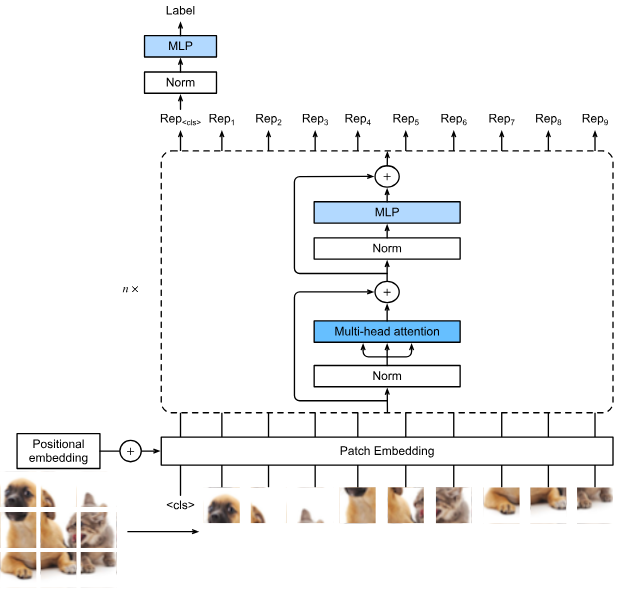

# VIT

##  1. 原理讲解：ViT 的核心工作流

ViT 的核心思想非常粗暴：把图像当成文本序列来处理。 

NLP 处理的是一串单词。ViT 将一张 $H \times W$ 的图像，切分成一个个固定大小（如 $16 \times 16$）的图像块（Patch）。这些 Patch 就相当于 NLP 中的“单词（Token）”。

把每个 $16 \times 16 \times 3$ 的图像块展平成一个一维向量，然后通过一个全连接层（线性映射），将其投影到指定的维度 $D$。

在序列头部插入一个可学习的 [CLS] Token，用于在最后提取整个图像的全局特征进行分类。同时，给每个 Token 加上位置编码（Positional Embedding），否则模型不知道哪个块在图像的哪个位置。

将准备好的序列送入标准的 Transformer Encoder。通过多头自注意力（Multi-Head Self-Attention），每个图像块都在与所有其他图像块交换信息，建立全局依赖。

经过多层 Transformer 后，提取 [CLS] Token 对应的输出向量，送入一个简单的多层感知机（MLP）得出最终的分类结果。

## 2. 公式推导

我们可以用严谨的数学语言将上述过程表达出来。假设输入图像为 $\mathbf{x} \in \mathbb{R}^{H \times W \times C}$，Patch 大小为 $P \times P$。

> 1. 序列化与投影 (Patch Embedding)

图像被分为 $N$ 个 Patch，其中 $N = \frac{H \times W}{P^2}$。

每个 Patch 展平后的维度是 $P^2 \cdot C$。我们用一个可学习的矩阵 $\mathbf{E} \in \mathbb{R}^{(P^2 \cdot C) \times D}$ 将其映射到 $D$ 维：

$$\mathbf{x}_p^i \mathbf{E} \in \mathbb{R}^D \quad (i = 1, 2, \dots, N)$$

> 2. 构建输入序列 $\mathbf{z}_0$

加入用于分类的可学习 Token $ \mathbf{x}_{class} $ 和位置编码 $\mathbf{E}_{pos} \in \mathbb{R}^{(N+1) \times D}$：

$$\mathbf{z}_0 = [\mathbf{x}_{class}; \mathbf{x}_p^1 \mathbf{E}; \mathbf{x}_p^2 \mathbf{E}; \cdots; \mathbf{x}_p^N \mathbf{E}] + \mathbf{E}_{pos}$$

此时 $\mathbf{z}_0$ 的维度是 $(N+1) \times D$。

> 3. Transformer Encoder (第 $\ell$ 层)

Encoder 由多头自注意力（MSA）和多层感知机（MLP）组成，每层前都有 Layer Normalization (LN)，并带有残差连接：

$$\mathbf{z}'_{\ell} = \text{MSA}(\text{LN}(\mathbf{z}_{\ell-1})) + \mathbf{z}_{\ell-1}$$$$\mathbf{z}_{\ell} = \text{MLP}(\text{LN}(\mathbf{z}'_{\ell})) + \mathbf{z}'_{\ell}$$

MSA 的内部推导：

对于输入 $X$，生成查询、键、值矩阵：$$Q = XW^Q, \quad K = XW^K, \quad V = XW^V$$

注意力的计算公式为（其中 $d_k$ 是缩放因子）：

$$\text{Attention}(Q, K, V) = \text{softmax}\left(\frac{QK^T}{\sqrt{d_k}}\right)V$$

> 4. 分类头

经过 $L$ 层 Encoder 后，取第 0 个位置（即 [CLS] Token 的位置）的特征，经过 LN 后送入 MLP：$$y = \text{MLP}(\text{LN}(\mathbf{z}_L^0))$$

## 3. 张量变化举例

> 1. 从像素到序列的物理转换

输入图像 $X$: [B, 3, 224, 224]

➡️ 卷积切块 (Conv2d)

隐藏权重 (Weight): 卷积核的形状是 [out_channels, in_channels, kernel_H, kernel_W] = [768, 3, 16, 16]。偏置 (Bias) 是 [768]。

计算机制: 768 个不同的 $3 \times 16 \times 16$ 卷积核，以 stride=16 在原图上滑动。每个卷积核在一个 Patch 上做点积产生 1 个标量。768 个核产生 768 个标量。

输出张量: [B, 768, 14, 14]

➡️ 展平 (Flatten) & 转置 (Transpose)

隐藏权重: 无。这是纯粹的内存重排（Reshape）。

计算机制: $14 \times 14 = 196$。将空间维度合并，再将通道维度换到最后。

输出张量: [B, 196, 768]

> 2. 注入全局视野与空间位置

➡️ 拼接 [CLS] Token (Concat)

隐藏权重: 一个可学习的 Parameter 矩阵，形状为 [1, 1, 768]。

计算机制: 首先将这个参数在 Batch 维度上复制（Broadcast） $B$ 次，变成 [B, 1, 768]。然后用 torch.cat 沿着序列维度（dim=1）拼接到张量头部。

输出张量: $196 + 1 = 197$。结果为 [B, 197, 768]。

➡️ 加上位置编码 (Positional Embedding)

隐藏权重: 另一个可学习的 Parameter 矩阵，形状为 [1, 197, 768]。

计算机制: 逐元素相加（Element-wise Addition）。PyTorch 会自动将形状为 [1, 197, 768] 的权重广播到每一个 Batch 上。

输出张量: 维度不变，仍为 [B, 197, 768]。至此，准备工作彻底完成。进入 Transformer 的张量形状 [B, 197, 768] 就像是被封死了一样，在接下来的 12 层 Encoder 中首尾形状绝对不发生改变。
> 3. Transformer Encoder 内部的维度碰撞

我们剥开 1 层 Encoder，看看 [B, 197, 768] 是如何在这个“黑盒”里流动并保持形状的。

➡️ Layer Normalization 1

隐藏权重: 缩放系数 $\gamma$ 和平移系数 $\beta$，形状均为 [768]。

输出张量: [B, 197, 768]（仅改变数值分布）。

➡️ 多头自注意力 (MSA)

隐藏权重: 生成 $Q, K, V$ 需要三个线性层，数学上等价于乘以权重矩阵 $W_Q, W_K, W_V$。每一个的形状都是 [768, 768]。（偏置均为 [768]）。

计算机制 (矩阵乘法): 输入 [B, 197, 768] $\times$ 权重 [768, 768] = $Q, K, V$ 矩阵 [B, 197, 768]。

内部注意力计算：$Softmax(Q \cdot K^T) \cdot V \rightarrow$ [B, 197, 197] $\times$ [B, 197, 768] = [B, 197, 768]。

输出投影 (Output Projection): 算完注意力后，再经过一个线性层 $W_O$，权重形状 [768, 768]。

输出张量: [B, 197, 768]。加上残差连接，形状依然死死咬在 [B, 197, 768]。

➡️ MLP 模块 (前馈神经网络)

MLP 的作用是升维再降维，以提取更丰富的特征。它包含两个线性层（Linear）。

隐藏权重 1 (升维): FC1 的数学权重矩阵形状为 [768, 3072] （通常扩大 4 倍）。

计算：[B, 197, 768] $\times$ [768, 3072] $\rightarrow$ 中间激活张量 [B, 197, 3072]。

隐藏权重 2 (降维): FC2 的数学权重矩阵形状为 [3072, 768]。

计算：[B, 197, 3072] $\times$ [3072, 768] $\rightarrow$ 恢复为 [B, 197, 768]。

输出张量: 加上残差连接，本层 Encoder 输出 [B, 197, 768]。

> 4. 提取与输出

经过 12 次上述的 Encoder 循环后，我们得到了最终的高级特征表征。

➡️ 提取特征 (Index)

计算机制: 代码执行 x[:, 0]。我们抛弃了后面 196 个代表局部图像块的 Token，只保留第 0 个位置的 [CLS] Token（因为它在自注意力机制中已经“看”过了所有其他的图像块，吸纳了全局信息）。

输出张量: 序列维度被切掉，变成了 [B, 768]。

➡️ 分类头 (Classification Head / Linear)

隐藏权重: 最后一个线性映射层的权重矩阵 $W_{head}$，形状为 [768, 1000]（假设是 ImageNet 的 1000 分类）。偏置形状为 [1000]。

计算机制 (矩阵乘法):[B, 768] $\times$ [768, 1000] = [B, 1000]。

最终输出张量: [B, 1000]。