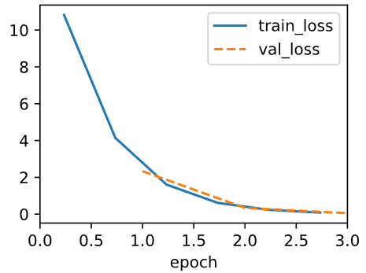

# 代码


> 非面向对象

```python
# 1. 准备数据
X = torch.randn(100, 2)
y = torch.matmul(X, torch.tensor([2.0, -3.4])) + 4.2

# 2. 定义模型参数 (w 和 b)
w = torch.randn(2, requires_grad=True) # 告诉PyTorch这里的梯度要追踪
b = torch.zeros(1, requires_grad=True)

# 3. 极简训练循环
lr = 0.03
for epoch in range(10):
    # --- A. 前向传播 (公式: y = Xw + b) ---
    y_hat = torch.matmul(X, w) + b
    
    # --- B. 计算损失 (公式: (y - y_hat)^2 ) ---
    loss = ((y_hat - y) ** 2).mean()
    
    # --- C. 反向传播 (求梯度) ---
    loss.backward()  # 这一步之后，w.grad 和 b.grad 就有值了
    
    # --- D. 更新参数 (公式: w = w - lr * grad) ---
    with torch.no_grad(): # 更新参数时不需要算梯度
        w -= lr * w.grad
        b -= lr * b.grad
        
        # --- E. 清空梯度 (为下一轮做准备) ---
        w.grad.zero_()
        b.grad.zero_()
    
    print(f'Epoch {epoch}, Loss: {loss.item()}')
```

我们注意到这句代码

```python
with torch.no_grad(): # 更新参数时不需要算梯度
```

> 设计思想（面向切面编程）

torch框架会记录记录计算的过程，这会帮助自动求导，也就是逆向求梯度过程，所以并不需要记录更新参数过程，因为我们并不需要对更新参数的梯度。

**面向切面编程** ： 把“主线任务”和“支线任务”剥离开

在这个例子中，将不需要求导的部分直接用一个语句直接剥离，并不需要过多冗余代码

其在验证集中验证的时候也需要加上

## 面向对象代码

```python
def fit_epoch(self):
    self.model.train()
    for batch in self.train_dataloader:
        loss = self.model.training_step(self.prepare_batch(batch))
        # 清空梯度
        self.optim.zero_grad()
        with torch.no_grad():  # 关闭梯度追踪
            loss.backward()  # 反向传播，为了更新参数
            if self.gradient_clip_val > 0:  # To be discussed later
                self.clip_gradients(self.gradient_clip_val, self.model)
            self.optim.step() # 更新参数
        self.train_batch_idx += 1
    if self.val_dataloader is None:
        return
    # 结束训练过程，开启验证阶段
    self.model.eval()
    for batch in self.val_dataloader:
        with torch.no_grad():
          # 在验证集上计算损失
            self.model.validation_step(self.prepare_batch(batch))
        self.val_batch_idx += 1
```

每次epoch都需要对验证集进行打分，即训练一次验证一次，目的是为了防止拟合，过程中记录验证集和训练集的loss变化情况，如果训练集一直下降但是验证集突然上升说明过拟合了。
