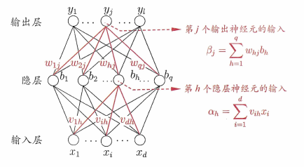

# 2.多层感知机

下图就是一个简单的神经网路

很熟悉，之前学了softmax线性回归，理解为两层线性变换（Linear/Dense）嵌套，中间加一个激活函数

> 激活函数必要性证明

如果第一层的模型为y = 2x,第二层的模型表达式为z = 3y,则z = 3(2x)=6x。显然，这个总体模型一层就够了。所以需要一个中间函数f,将f(y) = f(2x)进行非线性变换之后得到p = f(y),然后将这个p作为隐藏层作为输出层的输入，即z = 3f(y) = 3p。当然，输出层也需要进行一次非线性变换，即需要激活一次。激活这个名词看似高深莫测，其实就是进行一次非线性变换。

向前传播的时候如果是relu函数，一个隐藏层的神经元的输入经过relu激活变换为0，则根据线性变换规则，这个神经元就失效了。

虽然 ReLU 让计算变快并解决了梯度消失，但如果学习率太大，或者参数初始化不当，可能会导致某个神经元在所有数据上的输入都是负的。 后果： 这个神经元的梯度永远是 0，参数永远不更新，像“死掉”了一样。这也是为什么后来出现了 Leaky ReLU（负区间给一点点斜率）的原因。

当然，在反向传播中，也需要根据pytorch记录的激活函数的前向传播得到其导数。

## 激活函数

1. ReLU

小于零的数直接赋值为零，大于零等于本身
$$
ReLU(x) = max(x,0)
$$

**导数**

2. sigmoid

$$
sigmoid(x) = \frac{1}{1+e^{-x}}
$$
sigmoid函数可以将一个数压缩到0-1

**导数**

$$
\frac{d}{dx} \mathrm{sigmoid}(x) = \frac{\exp(-x)}{(1 + \exp(-x))^2} = \mathrm{sigmoid}(x) (1 - \mathrm{sigmoid}(x)).
$$

3. tanh

输出范围压缩在（-1.1）

$$
tanh = \frac{1-e^{-2x}}{1+e^{-2x}} = \frac{e^x - e^{-x}}{e^x + e^{-x}}
$$

**导数**

$$\frac{d}{dx} \tanh(x) = 1 - \tanh^2(x).$$

## 前向传播

下图为前向传播计算图

这个图很清晰了。其中方框代表变量，圆圈代表计算操作符。

我们从最底层从左到右解释。

$$
\boldsymbol{z} = \boldsymbol{W^{(1)}}\boldsymbol{x}
$$
$$
\boldsymbol{h} = \phi(\boldsymbol{z})
$$
以上公式就是输入层与参数列表相乘之后进行激活得到的隐藏层的数据$h$

$$
\boldsymbol{o} = \boldsymbol{W^{(2)}}\boldsymbol{h}
$$
以上公式就是隐藏层到输出层的参数乘积之后得到的输出。

然后，通过与真的标签值$y$与输出$o$计算loss。得到L
$$
L = l(\boldsymbol{o},\boldsymbol{y})
$$

最后运用拉格朗日算子对模型进行过拟合计算。
$$
\boldsymbol{J} = \boldsymbol{L} + \boldsymbol{s}
$$

其中
$$
s = \frac{\boldsymbol{\lambda}}{2}((||\boldsymbol{W^{(1)}}||)^2_F + (||\boldsymbol{W^{(2)}}||)^2_F)
$$