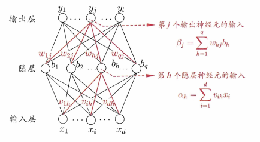
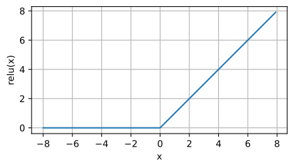
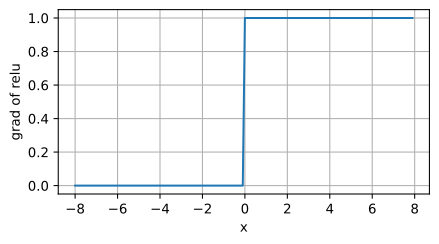
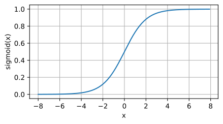
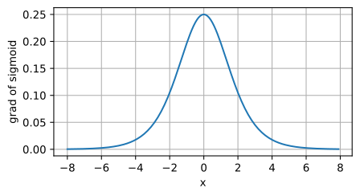
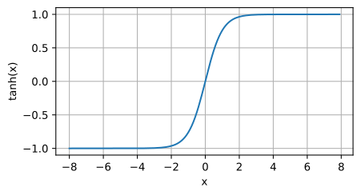
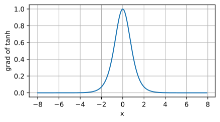

# 2.多层感知机

下图就是一个简单的神经网路

很熟悉，之前学了softmax线性回归，理解为两层线性变换（Linear/Dense）嵌套，中间加一个激活函数

> 激活函数必要性证明

如果第一层的模型为y = 2x,第二层的模型表达式为z = 3y,则z = 3(2x)=6x。显然，这个总体模型一层就够了。所以需要一个中间函数f,将f(y) = f(2x)进行非线性变换之后得到p = f(y),然后将这个p作为隐藏层作为输出层的输入，即z = 3f(y) = 3p。当然，输出层也需要进行一次非线性变换，即需要激活一次。激活这个名词看似高深莫测，其实就是进行一次非线性变换。

向前传播的时候如果是relu函数，一个隐藏层的神经元的输入经过relu激活变换为0，则根据线性变换规则，这个神经元就失效了。

虽然 ReLU 让计算变快并解决了梯度消失，但如果学习率太大，或者参数初始化不当，可能会导致某个神经元在所有数据上的输入都是负的。 后果： 这个神经元的梯度永远是 0，参数永远不更新，像“死掉”了一样。这也是为什么后来出现了 Leaky ReLU（负区间给一点点斜率）的原因。

当然，在反向传播中，也需要根据pytorch记录的激活函数的前向传播得到其导数。

## 激活函数

1. ReLU

小于零的数直接赋值为零，大于零等于本身
$$
ReLU(x) = max(x,0)
$$

**导数**

2. sigmoid

$$
sigmoid(x) = \frac{1}{1+e^{-x}}
$$
sigmoid函数可以将一个数压缩到0-1

**导数**

$$
\frac{d}{dx} \mathrm{sigmoid}(x) = \frac{\exp(-x)}{(1 + \exp(-x))^2} = \mathrm{sigmoid}(x) (1 - \mathrm{sigmoid}(x)).
$$

3. tanh

输出范围压缩在（-1.1）

$$
tanh = \frac{1-e^{-2x}}{1+e^{-2x}} = \frac{e^x - e^{-x}}{e^x + e^{-x}}
$$

**导数**

$$\frac{d}{dx} \tanh(x) = 1 - \tanh^2(x).$$

## 前向传播

下图为前向传播计算图

这个图很清晰了。其中方框代表变量，圆圈代表计算操作符。

我们从最底层从左到右解释。

$$
\boldsymbol{z} = \boldsymbol{W^{(1)}}\boldsymbol{x}
$$
$$
\boldsymbol{h} = \phi(\boldsymbol{z})
$$
以上公式就是输入层与参数列表相乘之后进行激活得到的隐藏层的数据$h$

$$
\boldsymbol{o} = \boldsymbol{W^{(2)}}\boldsymbol{h}
$$
以上公式就是隐藏层到输出层的参数乘积之后得到的输出。

然后，通过与真的标签值$y$与输出$o$计算loss。得到L
$$
L = l(\boldsymbol{o},\boldsymbol{y})
$$

最后运用拉格朗日算子对模型进行过拟合计算。
$$
\boldsymbol{J} = \boldsymbol{L} + \boldsymbol{s}
$$

其中
$$
s = \frac{\boldsymbol{\lambda}}{2}((||\boldsymbol{W^{(1)}}||)^2_F + (||\boldsymbol{W^{(2)}}||)^2_F)
$$

## 反向传播

在高数中的求导链式法则是函数对某个未知数求导的法则，涉及到的基本是一个值，在深度学习中涉及到的是众多样本值标签，所以用向量表示

普通的微积分公式通常写成简单的乘法，但在深度学习中，$X, Y, Z$ 通常是 向量、矩阵或张量 (Tensors)，而不是单个数字。直接相乘可能会导致维度不匹配（比如一个 $3 \times 4$ 的矩阵和一个 $4 \times 5$ 的矩阵相乘）。这里的 prod 运算符代表了一种广义的 矩阵乘法 (Matrix Multiplication) 或张量积。它隐藏了为了让维度对齐而必须进行的 转置 (Transpose) 和 换位 操作。

$\frac{\partial Z}{\partial Y}$ 的形状可能是(10,20)

$\frac{\partial Y}{\partial X}$ 的形状可能是(20,5)

直接相乘没问题：$(10, 20) \times (20, 5) = (10, 5)$。

但是！ 有时候推导出来的导数形状可能是反的，比如 $(5, 20)$。这时候直接乘就报错了。
所以 prod(A, B) 的潜台词是：“别管形状怎么乱，我会自动把 A 或者 B 转置一下，让它们的中间维度对齐，然后执行矩阵乘法。”

> 梯度推导

$$\frac{\partial J}{\partial L} = 1 \text{ and } \frac{\partial J}{\partial s} = 1. $$

$$\frac{\partial J}{\partial \mathbf{o}} = \text{prod}\left(\frac{\partial J}{\partial L}, \frac{\partial L}{\partial \mathbf{o}}\right) = \frac{\partial L}{\partial \mathbf{o}} \in \mathbb{R}^q. $$

$$\frac{\partial s}{\partial \mathbf{W}^{(1)}} = \lambda \mathbf{W}^{(1)} \text{ 且 } \frac{\partial s}{\partial \mathbf{W}^{(2)}} = \lambda \mathbf{W}^{(2)}. $$

$$\frac{\partial J}{\partial \mathbf{W}^{(2)}} = \text{prod}\left(\frac{\partial J}{\partial \mathbf{o}}, \frac{\partial \mathbf{o}}{\partial \mathbf{W}^{(2)}}\right) + \text{prod}\left(\frac{\partial J}{\partial s}, \frac{\partial s}{\partial \mathbf{W}^{(2)}}\right) = \frac{\partial J}{\partial \mathbf{o}} \mathbf{h}^\top + \lambda \mathbf{W}^{(2)}. \tag{1}$$

$$\frac{\partial J}{\partial \mathbf{h}} = \text{prod}\left(\frac{\partial J}{\partial \mathbf{o}}, \frac{\partial \mathbf{o}}{\partial \mathbf{h}}\right) = {\mathbf{W}^{(2)}}^\top \frac{\partial J}{\partial \mathbf{o}}. $$

$$\frac{\partial J}{\partial \mathbf{z}} = \text{prod}\left(\frac{\partial J}{\partial \mathbf{h}}, \frac{\partial \mathbf{h}}{\partial \mathbf{z}}\right) = \frac{\partial J}{\partial \mathbf{h}} \odot \phi'(\mathbf{z}).$$

$$\frac{\partial J}{\partial \mathbf{W}^{(1)}} = \text{prod}\left(\frac{\partial J}{\partial \mathbf{z}}, \frac{\partial \mathbf{z}}{\partial \mathbf{W}^{(1)}}\right) + \text{prod}\left(\frac{\partial J}{\partial s}, \frac{\partial s}{\partial \mathbf{W}^{(1)}}\right) = \frac{\partial J}{\partial \mathbf{z}} \mathbf{x}^\top + \lambda \mathbf{W}^{(1)}. \tag{2}$$

从中我们可以总结一些规律

1. 不管是$J$对于$\boldsymbol{w_1}$还是$\boldsymbol{w_2}$的梯度，结果都是后一层传入的梯度误差和前一层输入的转置的乘积的形式

推导对应：公式 (1) 中：$\frac{\partial J}{\partial o} \mathbf{h}^\top$。这里 $\frac{\partial J}{\partial o}$ 是输出层的误差梯度，$\mathbf{h}$ 是 $W^{(2)}$ 的输入（即隐藏层输出）。公式 (2) 中：$\frac{\partial J}{\partial z} \mathbf{x}^\top$。这里 $\frac{\partial J}{\partial z}$ 是隐藏层的误差梯度，$\mathbf{x}$ 是 $W^{(1)}$ 的输入。

2. 哈达马积效应
   
梯度经过激活函数时需要逐元素乘上该激活函数的导数

$$\frac{\partial J}{\partial z} = \frac{\partial J}{\partial h} \odot \phi'(z)$$。
这一步操作该笔拿了梯度的数值，通常不改变梯度的形状（矩阵的维度）。**这一步可能造成梯度消失和梯度爆炸**

3. 正则化项的权重衰减规律
   
$W_{new} = W - \eta (\dots + \lambda W)$。这意味着每次更新，权重都会先缩小一点点（$(1-\eta\lambda)W$），这就是为什么L2正则化被称为“权重衰减”（Weight Decay）。

4. 形状一致性原则
任何标量损失函数 $J$ 关于参数矩阵 $W$ 的梯度 $\frac{\partial J}{\partial W}$，其形状（维度）必须与 $W$ 完全一致。文中提到 $\frac{\partial J}{\partial W^{(2)}} \in \mathbb{R}^{q \times h}$，这与 $W^{(2)}$ 的维度是一致的。推导中的转置操作（如 $h^\top$）正是为了凑出这个正确的形状（矩阵的维度）。

## 实际例子

设定场景：具体的数字想象我们要预测房价。

输入层 ($\mathbf{x}$)：也就是你的输入特征。

假设有 3 个特征：[面积, 房龄, 卧室数]。

形状：$3 \times 1$ （3行1列的列向量）

隐藏层 ($\mathbf{h}$)：中间处理层。假设我们要把它映射到 4 个神经元。

形状：$4 \times 1$输出层 ($\mathbf{o}$)：

最终预测结果。假设我们预测 2 个值：[房价, 租金]。形状：

$2 \times 1$

### 第一阶段：前向传播（搭建路基）
在计算梯度之前，我们先得知道权重矩阵长什么样。

第一层权重 $\mathbf{W}^{(1)}$：要把 3个特征 变成 4个神经元。矩阵必须是 $4 \times 3$。运算：$(4 \times 3) \times (3 \times 1) = 4 \times 1$ (形状匹配！)

第二层权重 $\mathbf{W}^{(2)}$：要把 4个神经元 变成 2个输出。矩阵必须是 $2 \times 4$。运算：$(2 \times 4) \times (4 \times 1) = 2 \times 1$ (形状匹配！)

### 第二阶段：反向传播（梯度形状变形记）
现在我们算出了误差，要开始根据你图片里的公式往回传了。记住黄金法则：梯度的形状必须和原变量一模一样。

步骤 1：从输出层开始目标：算出 $\mathbf{o}$ 的梯度。形状：因为 $\mathbf{o}$ 是 $2 \times 1$，所以它的梯度也是 $2 \times 1$。（这步很简单，形状不变）

步骤 2：算出 $\mathbf{W}^{(2)}$ 的梯度（外积规律）目标：算出 $\mathbf{W}^{(2)}$ 该怎么更新。黄金法则：$\mathbf{W}^{(2)}$ 是 $2 \times 4$，所以它的梯度必须也是 $2 \times 4$。手里有的：输出层梯度：$2 \times 1$隐藏层输入 $\mathbf{h}$：$4 \times 1$

怎么凑出 $2 \times 4$？根据图片公式 (5.3.11)：$\text{梯度} \times \text{输入}^\top$运算：$(2 \times 1) \times (1 \times 4) = \mathbf{2 \times 4}$成功！ 这里把 $\mathbf{h}$ 转置（躺平），就凑出了矩阵。

步骤 3：把梯度传给隐藏层（转置规律 - 关键点！）

目标：算出 $\mathbf{h}$ 的梯度（误差传到隐藏层是多少）。

黄金法则：$\mathbf{h}$ 是 $4 \times 1$，所以它的梯度必须也是 $4 \times 1$。

手里有的：输出层梯度：$2 \times 1$权重矩阵 $\mathbf{W}^{(2)}$：$2 \times 4$

怎么凑出 $4 \times 1$？直接乘 $\mathbf{W}^{(2)}$ 肯定不行，$(2 \times 4)$ 和 $(2 \times 1)$ 没法乘。根据图片公式 (5.3.12)：$\mathbf{W}^{(2)\top} \times \text{梯度}$把 $\mathbf{W}^{(2)}$ 转置一下，变成 $4 \times 2$。运算：$(4 \times 2) \times (2 \times 1) = \mathbf{4 \times 1}$成功！ 这就是为什么公式里必须有个转置 $T$，是为了把维度“扭”回来，让误差能流进隐藏层。

步骤 4：穿过激活函数（哈达玛积规律 - 你的疑惑点）

场景：隐藏层其实是经过激活函数 $\mathbf{h} = \text{ReLU}(\mathbf{z})$ 的。现在我们要算 $\mathbf{z}$ 的梯度。

黄金法则：$\mathbf{z}$ 是 $4 \times 1$，梯度也得是 $4 \times 1$。

手里有的：$\mathbf{h}$ 的梯度：$4 \times 1$$\text{ReLU}$ 的导数：比如 $\mathbf{z}$ 里面有正有负，导数可能长这样 $[1, 0, 1, 1]^\top$，也是 $4 \times 1$。

怎么算？根据图片公式 (5.3.13)：$\text{梯度} \odot \text{导数}$运算：$(4 \times 1) \odot (4 \times 1) = \mathbf{4 \times 1}$解释：这就是为什么我说它不改变形状。它只是把梯度向量里的某些数变小或变0（如果遇到了ReLU的负区），但它不会把 4维 变成 3维 或 5维。它像一个过滤器，而不是变形金刚。

步骤 5：算出 $\mathbf{W}^{(1)}$ 的梯度

目标：算出第一层权重 $\mathbf{W}^{(1)}$ 的更新量。

黄金法则：$\mathbf{W}^{(1)}$ 是 $4 \times 3$，梯度必须也是 $4 \times 3$。

手里有的：隐藏层梯度 $\mathbf{z}$：$4 \times 1$最开始的输入 $\mathbf{x}$：$3 \times 1$

怎么凑出 $4 \times 3$？根据图片公式 (5.3.14)：$\text{梯度} \times \text{输入}^\top$运算：$(4 \times 1) \times (1 \times 3) = \mathbf{4 \times 3}$完美闭环！

[梯度消失和梯度爆炸](https://www.bilibili.com/video/BV1KL79z9E97/?spm_id_from=333.1007.top_right_bar_window_history.content.click)
## 梯度消失

假设还是三层神经网络，不同的是第三层有一个激活函数以模拟深层神经网路中激活函数对梯度的影响。

输入：$\mathbf{x}$

第1层（隐藏层）：$\mathbf{z}_1 = \mathbf{W}_1 \mathbf{x}, \quad \mathbf{h}_1 = \sigma(\mathbf{z}_1)$

第2层（隐藏层）：$\mathbf{z}_2 = \mathbf{W}_2 \mathbf{h}_1, \quad \mathbf{h}_2 = \sigma(\mathbf{z}_2)$

第3层（输出层）：$\mathbf{z}_3 = \mathbf{W}_3 \mathbf{h}_2, \quad \mathbf{o} = \sigma(\mathbf{z}_3)$

损失函数：$J(\mathbf{o}, \mathbf{y})$

$$\frac{\partial J}{\partial \mathbf{h}_2} = \frac{\partial J}{\partial \mathbf{o}} \cdot \frac{\partial \mathbf{o}}{\partial \mathbf{z}_3} \cdot \frac{\partial \mathbf{z}_3}{\partial \mathbf{h}_2}$$

代入具体的数学关系：

$\frac{\partial \mathbf{o}}{\partial \mathbf{z}_3}$ 是激活导数 $\sigma'(\mathbf{z}_3)$

$\frac{\partial \mathbf{z}_3}{\partial \mathbf{h}_2}$ 是权重 $\mathbf{W}_3$

$$\text{误差到达} \mathbf{h}_2 = \text{Loss梯度} \times [\sigma'(\mathbf{z}_3) \cdot \mathbf{W}_3]$$

第二步：剥开中间层（第2层）

现在误差在 $\mathbf{h_2}$ 这里，我们要把它传给 $\mathbf{h_1}$。链式法则再次启动：$$\frac{\partial J}{\partial \mathbf{h_1}} = \frac{\partial J}{\partial \mathbf{h_2}} \cdot \frac{\partial \mathbf{h_2}}{\partial \mathbf{z_2}} \cdot \frac{\partial \mathbf{z_2}}{\partial \mathbf{h_1}}$$

我们将第一步算出的 $\frac{\partial J}{\partial \mathbf{h_2}}$ 代入，并展开后两项：$$\text{误差到达} \mathbf{h_1} = \underbrace{\left( \text{Loss梯度} \times [\sigma'(\mathbf{z_3}) \cdot \mathbf{W_3}] \right)}_{\text{来自上一层的误差}} \times [\sigma'(\mathbf{z_2}) \cdot \mathbf{W_2}]$$

第三步：剥开最里层（第1层）—— 连乘出现！

最后，我们要算 $\mathbf{W}_1$ 的梯度。

根据李沐书里的公式，$\frac{\partial J}{\partial \mathbf{W}_1} = \frac{\partial J}{\partial \mathbf{z}_1} \cdot \mathbf{x}^\top$。

我们需要先算出 $\frac{\partial J}{\partial \mathbf{z_1}}$：$$\frac{\partial J}{\partial \mathbf{z_1}} = \frac{\partial J}{\partial \mathbf{h_1}} \cdot \sigma'(\mathbf{z_1})$$

把第二步那个长长的式子代进去：$$\frac{\partial J}{\partial \mathbf{z}_1} = \text{Loss梯度} \times \underbrace{[\sigma'(\mathbf{z_3}) \cdot \mathbf{W_3}_3]}_\{\text{第3层贡献}} \times \underbrace{[\sigma'(\mathbf{z}_2) \cdot \mathbf{W}_2]}_\{\text{第2层贡献}} \times \sigma'(\mathbf{z}_1)$$

### 连乘效应
如果我们将网络扩展到 $N$ 层，对于第 1 层的梯度，其核心部分的数学形式就是：
$$\frac{\partial J}{\partial \mathbf{z_1}} = \frac{\partial J}{\partial \mathbf{o}} \odot \prod_{k=2}^{N} \left( \mathbf{W_k^\top} \cdot \text{diag}(\sigma'(\mathbf{z_k})) \right)$$

### 激活函数选择与参数初始化

在深度学习中，将特征值进行标准化之后（防止梯度下降慢），会基于特征值均值为0，方法为1的分布。此外，权重是动态调整的所以需要初始化，那激活函数的选择和参数初始化有什么关系呢。

1. 核心公式：方差是会“累积”的想象神经元的一个最简单的线性运算：$$y = w_1 x_1 + w_2 x_2 + \dots + w_n x_n$$这里 $n$ 是输入的个数（比如上一层有 512 个神经元，那 $n=512$）。假设我们按照你的说法进行初始化：输入 $x$：假设它是标准化的，均值 $E(x)=0$，方差 $Var(x)=1$。权重 $w$：使用标准正态分布，均值 $E(w)=0$，方差 $Var(w)=1$。根据概率论中“独立随机变量乘积的方差”公式（假设 $w$ 和 $x$ 独立且均值为0）：$$Var(y) = Var(\sum_{i=1}^n w_i x_i) = \sum_{i=1}^n Var(w_i) Var(x_i)$$代入数值：$$Var(y) = \sum_{i=1}^{n} (1 \times 1) = n$$

2. 这意味着什么？（数值爆炸）如果你的隐藏层有 512 个神经元（$n=512$）：输入的方差是 1。经过第1层运算后，输出的方差变成了 512。经过第2层运算后，方差变成了 $512 \times 512 = \mathbf{262,144}$。...经过第10层，方差变成了 $512^{10}$（天文数字）。这意味着，虽然数据的均值还是 0，但数据的**分布范围（Spread）**变得极其巨大。数据点不是落在 $[-1, 1]$ 之间，而是落在 $[-100000, 100000]$ 甚至更大的范围内。

3. 为什么数值变大会导致“梯度消失”？既然数值变大了，不应该是梯度爆炸吗？为什么会消失？这就是激活函数（Sigmoid/Tanh）在这个“陷阱”中扮演的角色。请看下图的逻辑链条：初始化方差为1 $\rightarrow$ 网络层数加深 $\rightarrow$ 输出值 $y$ 变得极大或极小（比如 +10000 或 -10000）。这些巨大的 $y$ 值被送进了激活函数（比如 Sigmoid）。看 Sigmoid 的图像：当输入很大（+10000）时，Sigmoid 输出接近 1，曲线非常平，导数 $\approx 0$。当输入很小（-10000）时，Sigmoid 输出接近 0，曲线也非常平，导数 $\approx 0$。只有当输入在 0 附近（比如 $[-4, 4]$）时，导数才比较大。结论：因为初始化的方差太大（Var=1），导致神经元的输出迅速逃离了 0 附近的“敏感区”，全部落入了“饱和区”（Saturation Zone）。在饱和区，导数 $\sigma' \approx 0$。根据我们上一节推导的连乘公式：$$\text{梯度} = \dots \times \mathbf{W} \times \underbrace{\sigma'}_{\approx 0} \times \dots$$梯度瞬间变成 0，这就导致了梯度消失。4. 正确的做法是什么？（Xavier 初始化）为了防止方差爆炸，我们需要让输出的方差等于输入的方差（保持为 1）。回到公式：$$Var(y) = n \times Var(w) \times Var(x)$$我们希望 $Var(y) = Var(x)$，那就必须要求：$$n \times Var(w) = 1$$即：$$Var(w) = \frac{1}{n}$$

> Xavier 初始化

这就是 Xavier 初始化的由来！它告诉我们，权重的方差不能是 1，而应该是 $\frac{1}{n}$（比如 $1/512$）。换句话说，权重的标准差应该是 $\sqrt{1/n}$。如果用 $N(0, 1)$ 初始化：权重大概在 $\pm 1$ 左右，太大，每层信号放大 $n$ 倍。如果用 Xavier 初始化：权重大概在 $\pm 0.04$ 左右（当n=512），很小，刚好抵消掉 $n$ 个数的累加效应，让信号保持稳定。
   
## 梯度爆炸

对应的，梯度爆炸

## Dropout

[相关论文](https://www.sciencedirect.com/science/article/pii/S0004370214000216)