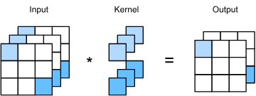
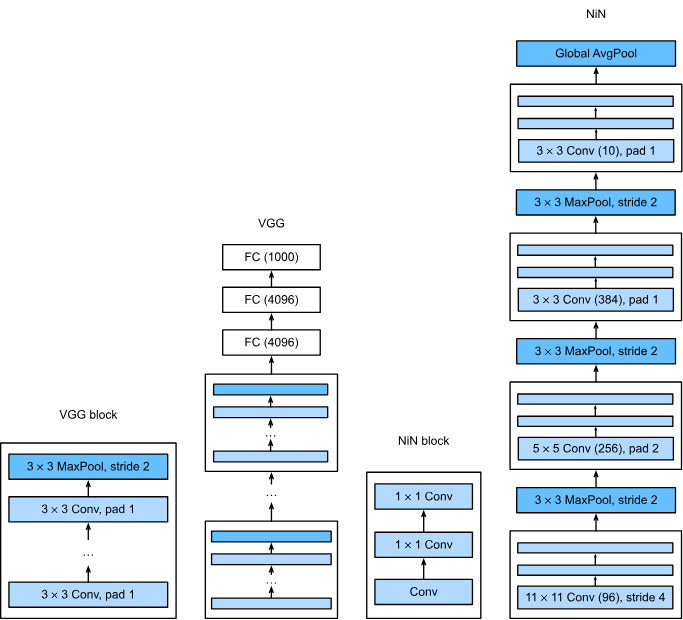

# CNN

## 1. 1x1卷积核

> 引入

随着卷积神经的加深和卷积核的增加，得到的特征数据越来越多，并且到了网络结尾处有全连接层，会使得参数爆炸，到了VGG-16的全连接层的总参数大小达到了上亿。

1X1 通过融合通道可以达到减少参数的作用，比如一个3X3像素的三通道样本，给定的卷积核分配给两个，每一个卷积核深度为三，图中卷积核上面的深度为3的核算一个卷积核，与左边的三通道的每个通道的同一个位置进行加权和，对每个位置的像素加权之后得到一个通道的输出

如果将三通道样本展平与核进行运算，得到结果可以看到这就是一个全连接层，只是很多的参数都共享了，这样参数量就减小了。

## 2. NiN(1X1应用)

> 引入

```python
def nin_block(out_channels, kernel_size, strides, padding):
    return nn.Sequential(
        nn.LazyConv2d(out_channels, kernel_size, strides, padding), nn.ReLU(),
        nn.LazyConv2d(out_channels, kernel_size=1), nn.ReLU(),
        nn.LazyConv2d(out_channels, kernel_size=1), nn.ReLU())
```

这个可以看成一个微缩版的AlexNet,如果堆叠nin_block,效果比AlexNet效果好