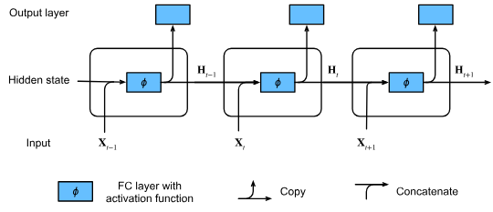

# RNN 循环神经网络

## 前向

$$H = 
\underbrace{X_t}_{(batch,Vinput)}  \times \underbrace{W_\{xh\}}_{(Vinput,hidden)} + \underbrace{H_\{t-1\}}_{(batch,hidden)}  \times \underbrace{W_\{hh\}}_{(hidden,hidden)} + \underbrace{Bias}_\{(1,hidden)}
$$

$$
H_t = activate(H)
$$

打个比方我们将一个字表示为1X4，比如I表示为(1,2,3,4)此时的Vinput就是4，也就是一个字的维度。

在一般认识下一个t时刻就是一个字，但是如果这样算会非常慢，所以这里一个t表示的字数是batch数，比如此时此刻的输入是$X_t$其维度是$(batch,Vinput)$.这里需要注意的是一行就是一个字，$\underbrace{X_t}_{(batch,Vinput)}  \times \underbrace{W_\{xh\}}_{(Vinput,hidden)}$,其实这就是一个全连接形式，可以想象成batch个全连接

注意这里的维度变化，因为这是一个递归，hidden就是全连接的隐藏层神经元个数，一般都是比Vinput大的，因为这样效果更好，为了让状态H能够适应递归，如上公式进行维度对齐，保证了H都是$(hidden,hidden)$形状的

最初始状态设置为0

bias会根据广播机制加到每一个向量上

最终输出
$$
O_t = H_tW_{hq}+b_q
$$

## 反向传播

在预测值中保留前者的记忆加上此时的输入推理下一个时刻的预测值，通过下一个真实值和预测值进行构建损失函数。

第一步：建立一个具体的场景（前向传播）

假设我们的时间序列只有 3步（$t=1, 2, 3$）。我们的 RNN 简化公式如下（对应文中 9.7.1）：$$h_t = f(x_t, h_{t-1}, w_h)$$这里的关键是：$w_h$ 是共享参数，每一时刻都在用。

我们来看看 $h_3$ 是怎么算出来的：

$t=1$: $h_1 = f(x_1, h_0, w_h)$

$t=2$: $h_2 = f(x_2, h_1, w_h)$ （注意：$h_1$ 里包含了 $w_h$）

$t=3$: $h_3 = f(x_3, h_2, w_h)$ （注意：$h_2$ 里包含了 $h_1$，也就是包含了两次 $w_h$）

第二步：核心难点（公式 9.7.4 的由来）
现在，我们要计算损失函数 $L$ 对 $w_h$ 的梯度。根据链式法则，我们需要计算 $\frac{\partial h_t}{\partial w_h}$。

让我们重点看 $t=3$ 时， $h_3$ 对 $w_h$ 的导数。因为 $h_3 = f(x_3, h_2, w_h)$，这里的 $w_h$ 出现在两个地方：

直接出现：作为函数 $f$ 的第三个参数。

间接出现：隐藏在 $h_2$ 里面（因为 $h_2$ 也是由 $w_h$ 算出来的）。

根据全导数公式（多元链式法则），我们得到：

$$\frac{\partial h_3}{\partial w_h} = \underbrace{\frac{\partial f(x_3, h_2, w_h)}{\partial w_h}}_{\text{直接影响}} + $$

$$
\underbrace{\frac{\partial f(x_3, h_2, w_h)}{\partial h_2} \cdot \frac{\partial h_2}{\partial w_h}}_{\text{间接影响（来自上一时刻）}}
$$
这正是你图片中公式 (9.7.4) 的具体形式！

第三步：展开递归（对应公式 9.7.5 - 9.7.7）

公式 9.7.4 告诉你：想求 $h_3$ 的梯度，你得先知道 $h_2$ 的梯度。那 $h_2$ 的梯度呢？同理：
$$\frac{\partial h_2}{\partial w_h} = \frac{\partial f}{\partial w_h} + \frac{\partial f}{\partial h_1} \cdot \frac{\partial h_1}{\partial w_h}$$

那 $h_1$ 的梯度呢？（假设 $h_0$ 是常数，不包含 $w_h$）：

$$\frac{\partial h_1}{\partial w_h} = \frac{\partial f}{\partial w_h} + 0$$

现在的任务是：把它们“套娃”套进去。 也就是把 $h_1$ 的式子代入 $h_2$，再把 $h_2$ 的式子代入 $h_3$。

为了方便对应你图片中的符号，我们定义一下（对应图片 9.7.6）：

$a_t = \frac{\partial h_t}{\partial w_h}$ (我们要算的完整梯度)

$b_t = \frac{\partial f}{\partial w_h}$ (当前这一步 $w_h$ 的直接贡献)

$c_t = \frac{\partial f}{\partial h_{t-1}}$ (时间传导系数，即上一时刻状态对当前状态的影响)

那么递归关系变成了：
$$a_3 = b_3 + c_3 \cdot a_2$$$$a_2 = b_2 + c_2 \cdot a_1$$$$a_1 = b_1$$
开始代入（这一步就是图片中 9.7.7 那个吓人的连乘 $\prod$ 的来源）：

$$\begin{aligned}
a_3 &= b_3 + c_3 \cdot (b_2 + c_2 \cdot a_1) \\\\
    &= b_3 + c_3 b_2 + c_3 c_2 \cdot (b_1) \\\\
    &= b_3 + c_3 b_2 + c_3 c_2 b_1
\end{aligned}$$

第四步：物理意义解读（看懂最后那个公式）

把上面的代数式翻译回物理意义，$\frac{\partial h_3}{\partial w_h}$ 由三部分组成：

$b_3$: $w_h$ 在 $t=3$ 时刻当下产生的贡献。

$c_3 b_2$: $w_h$ 在 $t=2$ 时刻产生的贡献，经过了一次时间传递（$c_3$）传到了 $t=3$。

$c_3 c_2 b_1$: $w_h$ 在 $t=1$ 时刻产生的贡献，经过了两次时间传递（$c_2$ 然后 $c_3$）传到了 $t=3$。

推广到通用公式 (9.7.7)：

$$\frac{\partial h_t}{\partial w_h} $$

$$= \underbrace{\frac{\partial f}{\partial w_h}}_{\text{当前时刻}}$$

$$+ \sum_{i=1}^{t-1} \left( \underbrace{\left( \prod_{j=i+1}^{t} \frac{\partial f(x_j, h_{j-1}, w_h)}{\partial h_{j-1}} \right)}_{\text{连乘：时间传递的损耗}} \cdot \underbrace{\frac{\partial f(x_i, h_{i-1}, w_h)}{\partial w_h}}_{\text{过去时刻的直接贡献}} \right) $$

> 缺点

这个模型只保留了最后的状态，信息被严重压缩

## seq2seq

输入序列到输出序列，做到输入输出可以不对等，这就是seq2seq.

创新点：
1. 计算整个句子$\boldsymbol{x} = (x_1,x_2,x_3,...,x_T)$的状态$h_T$.这个称为**编码器**
2. 用编码器的状态加入预测下一个词的参数，这个称为解码器

缺点：编码器压缩太多，句子太长不准确

## Bahdanau Attention

如何缓解seq2seq问题

1. 保留句子$\boldsymbol{x} = (x_1,x_2,x_3,...,x_T)$的所有状态$h_1,h_2,h_3,,...,h_T$作为编码器字典，
2. 解码器（注意力机制）计算与所有状态的相似度，与字典的所有状态进行加权预测

公式：
1. t时刻的状态向量：
$$
c_t = \sum^T_{j=1}\alpha_{tj}h_j
$$
这里的 $\alpha_{tj}$ 是权重，表示：在翻译第 $t$ 个词时，原句第 $j$ 个词有多重要？

2. t时刻的相似度计算(softmax归一化)
$$
\alpha_{tj} = \frac{exp(e_{tj})}{\sum^T_{k=1}exp(e_{tk})}
$$
$e_{tj}$ 只是一个原始分数

3. 原始分数（与状态序列每个状态的相似度数值得分）计算

$$
e_{tj} = \alpha(s_{t-1},h_j) =\underbrace{v^T_a tanh(W_as_{t-1}+U_ah_j)}_{RNN形式，但是融合的是编码器和解码器状态} 
$$

$s_{t-1}$是输出t时刻状态

4. $s_{t-1}$如何计算

LSTM,GRU,普通RNN都可以，Bahdanau Attention使用的是GRU

5. 解码器剩余工作（Ct向量并不表示预测词向量），计算St
同上，$$s_t = \text{GRU}(s_{t-1}, y_{t-1}, c_t)$$

6. 解码器剩余工作（Ct向量并不表示预测词向量），计算预测词y

$$P(y_t) = \text{Softmax}(W_o \cdot [s_t, y_{t-1}, c_t])$$

## Multi-Head Attention

多头注意力

在多头注意力中，将q,k,v分别做一次权重映射，分多次做，以达到关注点不同的效果，然后使用点积注意力机制得到不同角度的注意力向量拼接起来，使用一个权重将这些向量融合，然后使用softmax计算预测词