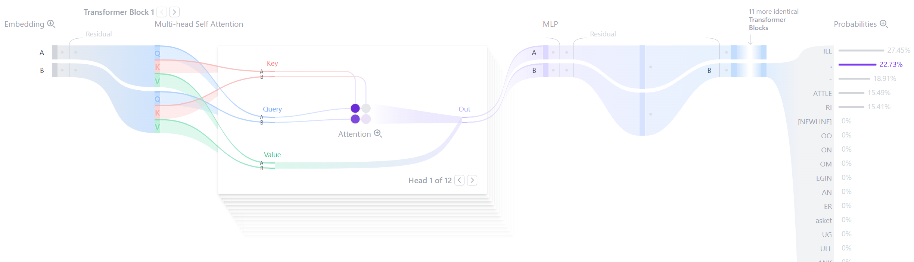

# NanoGPT（莎士比亚数据集）

## 1. 架构


### 1.1 参数

```C
// 1. 配置参数 (严格对应你的模型)
struct Config {
    //英文词表，与中文分词器不同的是英文保存的是abcd字母表和一些标点符号
    int vocab_size = 65;
    //上下文长度 包括了提示词长度和生成长度，因为生成是一个字一个字生成的，且依靠前面的词生成后面的词，虽然有kv缓存，但是
    //当二者长度超过上下文长度的时候，会截断前面的留下后面的
    int block_size = 256;
    //transfomer层数
    int n_layer = 6;
    //注意力头数量
    int n_head = 6;
    //词嵌入维度
    int n_embd = 384;
};
```

### 1.2 数据流动变化说明（训练）

> source

比如一次性送入B(batch)句话，一句话包含T个字母形成矩阵$(B,T)$

> 索引化

把一个字母索引化，例如a给定一个索引编号 21 => $ \\{'a':21\\} $

此时的输入矩阵形状：$(B,T)$

> embedding

词嵌入：将一个索引映射为一个向量，比如把$21=> (1,5,6,8..)$
一个索引转化为向量之后向量的长度称为词嵌入长度，当然这个长度越长能学习到的分量数据就越多，这里将词嵌入长度标记为n_embd，需要注意的是以后所有对一个词进行的操作直接作用于整个向量

此时的输入矩阵形状：$(B,T,n\\_embd)$

> 位置索引（绝对位置索引）

如果这句话a在首位，位置信息向量就为(1,1,1,1,..) 维度为n_embd

缺点（无法表示每个词之间的关系）

> 将词嵌入向量和位置索引向量相加

此时的输入矩阵形状：$(B,T,n\\_embd)$

**合理性**：可以看作两个参数相加，求导可以完整剥离两个变量

> dropout

防止过拟合

> 规范化

**必要性**：参考数据预处理的数据标准化

**缺点**： 规范化强行压缩值的范围，直接减弱了不同值之间的距离大小，如果在此之前经过了一个非线性的激活函数，由激活函数扩大的相邻位置的值直接缩小了，

**解决办法**： 学习参数将值还原回去，$$y = kx+b$$ 这里的x就是规范化之后的值

> 多头注意力

此时需要切分数据，到此为止数据形状是$(B,T,n\\_embd)$，为了让模型学到不同的东西，将数据平均分为6份，表示六个注意力头，如果词嵌入$n_embeding = 768$,切分后每个头的词向量变为为128。这个128我们用D标记$$D =  \frac{n\\_embd}{n\\_head}$$

此时的数据形状变为$(B,T,n\\_head,D)$ 可以转换为 $(B,n\\_head,T,D)$，然后分别乘对应的Q,K,V权重
这三个权重的形状都为(D,T),最后得到的Q，K,V都为(B,n\\_head,T,T)

**优化**：这样切分之后分别乘需要优化，由线性代数公式
$$
X[W_q,W_k,W_v] = [XW_q,XW_k,XW_v] = [Q,K,V] \\\\
(1,768) \odot (768,768+768+768) = (1,768+768+768)
$$

此时的数据形状变为$(B,T,1,3*n\\_embd)$

切分$Q,K,V$ 每一个的形状都为$(B,T,n\\_embd)$

具体到每一个头形状为$(B,T,D)$

> 计算 $Q \odot K^T$ (某一个注意力头中)

**注意**：虽然数据被切分了6份，但是是对每一个词向量切分的，也就是说每一个注意力头中包含了每一个词的一部分信息

这一步用于计算某一个词和所有词的得分，具体算式是
$$
Q \odot K^T \\\\ = (T,D) \odot (T,D)^T =  (T,D) \odot (D,T) \\\\ = (T,T)
$$

如何看待目的矩阵的元素值，我们可以拆开，例如在K的$(D,T)$的第一行也就是某一个词的1/6分量，和$K^T$的第二列，也是第二个词的1/6分量的点积，也就是$$(1,T) \odot (T,1) =  score$$,也就是会得到一个数，如果这两个词向量角度很小（这里可以看成这个头里面两个词的前后关系很接近，比如这里两个词是h,e,文中这两个词经常连着出现）score会很高，这也是我们想看到的。相反，如果这两个词是x,a这两个词在学习前后关系的头里面没什么练习，那么这两个向量训练出来的效果很可能就是垂直的，那么点积结果就是0

此时的数据形状$(B,n_head,T,T)$

**产生参数** $[W_q,W_k,W_v]$

> 掩码与decoder-only

在得到的这个$(T,T)$中一个词看到了和自己后面的词的得分，这对decoder-only的自监督模式不需要的，所以需要将这个词与后面所有的词的得分设为无限大（以便在后面的softmax中概率转化为0），所以这个矩阵就是一个下三角矩阵

> 缩放

在点积之后，因为得分是所有分量的乘积的和，尽管每个分量都规范化方差控制在了1以内，但是D个分量的和会使得分很大，所以需要除$\sqrt{D}$

此时的数据形状$(B,n_head,T,T)$

> softmax

将得分转化为概率（Transfomer核心），考虑所有元素的权重

此时的数据形状$(B,n_head,T,T)$

> 点积V $V: (T,D)$

用概率乘所有词的V，然后再加起来

**注意**：因为每一个词的1/6分量为(1,D),所以转化为概率的得分需要对整个分量乘积，然后加上所有乘过概率的不同词向量 例如词$h$和三个词$ h e r$的得分是0.01 0.8 0.19,那么
$$
V = (1,D)*0.01 + (1,D)*0.8 +(1,D)*0.19
$$

此时的数据形状$(B,n_head,T,D)$

> 全连接

这个时候注意力机制的核心就完了，分离的头也可以重新组装了，也就是被切分为6份的词向量可以堆叠起来弄完整了，

此时的数据形状$(B,T,n_head*D) = (B,T,n\\_embd)$


**产生参数** $w$ 全连接参数

> dropout

> 残差网络

将进入注意力模块之前和注意力机制出来后的数据相加

> 前向传播模块

1. 四倍升维全连接
2. 激活
3. 四倍降维全连接
4. dropout

**产生参数**：$w1,w2$

> 残差网络

将进入前向传播模块和前向传播模块出来后的数据相加

> 注意力模块和前向传播模块堆叠N层

以上输出的数据形状是$(B,T,n\\_embd)$

### 1.3 训练流向

> 全连接对齐vocab_size

$$
(B,T,n\\_embd) => (B,T,vocab\\_size)
$$

这里的vocab_size间接表示了每个索引对应词的得分情况

> 计算交叉熵

得到每个词的概率

> topk & k随机

在计算交叉熵的时候选定前k个得分高的词用于候选，计算概率之后，对这K个词进行概率随机选取，防止连续胡言乱语比如 text中t和e里的很近，模型很可能持续输出textextext....

### 1.4 生成流向

这里需要提前说明的是，一个词进去之后，经过Block(自注意力模块和前向传播模块)之后，会通过序列最后一个词得到下一个词的概率列表
