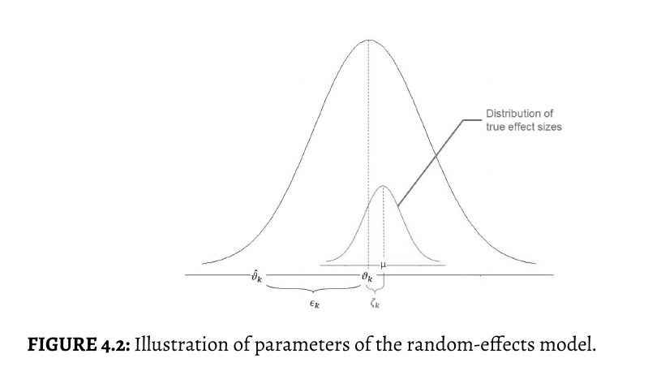

# 4.1 The Fixed-Effect & Random-Effects Model

## 4.1.1 The Fixed-Effect Model

* 权重 $w_k$ 代表某一个研究（单中心）的权重
  
$s^2_k$代表该研究的方差
$$
w_k = \frac{1}{s^2_k}
$$

* 多中心下的效应量 Effects Size

$$
\hat{\theta} = \frac{\sum^K_{K=1}\hat{\theta}_kw_k}{\sum^K_{K=1}w_k}
$$

即每个组计算出的效应量和该组权重乘积的和除所有权重的和

* 代码翻译

```R
####
# fixed Effects
####


# 加载必要的包
# library(metafor) # escalc 函数来自 metafor 包
library(dmetar)    # 用于 SuicidePrevention 数据集和可能的其他 metafor 依赖
library(tidyverse) # 用于 glimpse 等

# 加载数据集
data(SuicidePrevention)

# 使用 escalc 计算 Hedges' g (yi) 及其方差 (vi)
# "SMD" 表示标准化均数差，对于两组独立样本，默认计算 Hedges' g
SP_escalc_data <- escalc(
  measure = "SMD",
  m1i = mean.e, sd1i = sd.e, n1i = n.e, # 实验组数据列名
  m2i = mean.c, sd2i = sd.c, n2i = n.c, # 对照组数据列名
  slab = author,                       # 研究标签 (可选，但推荐)
  data = SuicidePrevention             # 包含这些列的数据框
)

# 查看数据结构，你会看到新增了 'yi' (效应量) 和 'vi' (方差) 两列
glimpse(SP_escalc_data)

# 1. 计算逆方差权重
# 'vi' 是由 escalc直接提供的方差。
# 所以，权重 w_i = 1 / vi_i
SP_escalc_data$w_manual <- 1 / SP_escalc_data$vi

# 2. 使用这些权重和 'yi' (效应量) 来计算合并效应量
# escalc 输出的 'yi' 就是效应量 (es)
pooled_effect_manual <- sum(SP_escalc_data$w_manual * SP_escalc_data$yi) /
  sum(SP_escalc_data$w_manual)

# 显示手动计算的合并效应量
print(paste("手动计算的合并效应量 (固定效应):", pooled_effect_manual))
```

## 4.1.2 The Random-Effects Model

> The random-effects model assumes that there is not only one true effect
size but a distribution of true effect sizes. The goal of the random-effects
model is therefore not to estimate the one true effect size of all studies,
but the mean of the distribution of true effects.

和fixed-effect model一样，random-effects model从假设观察到的效应量$\hat{\theta}$是真实效应量$\hat{\theta}$的估计值

$$
\hat{\theta_k} = \theta_k + \epsilon_k
$$

* 两层次误差结构
随机效应模型将总误差分解为两部分：

$$
观测效应量\hat{\theta_k} = \mu(所有研究真是效应量的总体均值)+\zeta_k(第k项研究的真实效应量\theta_k与\mu的偏差[研究间变异])+\epsilon_k(第k项研究内的抽样误差)
$$

1. 第一层误差（$\zeta_k$）：
   1. 反应真是效应量$\theta_k$围绕$\mu$的波动，即$\theta_k = \mu + \zeta_k$
   2. 假设$\zeta_k \text{\textasciitilde} N(0,\tau^2_k)$，其中$\tau^2_k$为研究间方差（异质性）
2. 第二层误差($\epsilon_k$)
   1. 反应抽样误差，假设$\epsilon_k \text{\textasciitilde} N(0,\sigma^2_k)$,其中$\sigma^2_k$为第k项研究的研究内方差



* 图解：

**预先假设：** 效应量和标准差服从正态分布（横坐标表示效应量，纵坐标表示方差）

在实际分析数据中，我们的数据最开始是单中心的数据，即使用某种度量方法获取的一些样本数据。
我们的核心目的是计算效应量，但其中存在误差，在随机效应模型中我们考虑两层误差。第一层是研究间的误差，是为了把不同的研究合并在一起产生的误差，比如不同药物对不同肤色人种之间的效应量，其中存在人群，干预方法，测量工具等差异造成，不同研究之间都是有差异的不是同质的（与fixed-effect区别）。第二层是研究内误差，因为样本数不同等因素造成误差。

### 4.1.2.1 Estimators of the Between-Study Heterogeneity

* 随机效应模型权重计算（加入研究间误差因素）：

研究间方差和研究内方差
$$
w^*_k = \frac{1}{s^2_k+\tau^2}
$$

* 随机效应计算

$$
\hat{\theta} = \frac{\sum^K_{K=1}\hat{\theta}_kw_k^*}{\sum^K_{K=1}w_k^*}
$$

* Which Estimator Should I Use(如何选择$\tau^2$的计算)?
  
There are no iron-clad rules when exactly which estimator should be used.
In many cases, there will only be minor differences in the results produced
by various estimators, meaning that you should not worry about this issue
too much.
When in doubt, you can always rerun your analyses using different τ2 esti-
mators, and see if this changes the interpretation of your results. Here are
a few tentative guidelines that you may follow in your own meta-analysis:

1. For effect sizes based on continuous outcome data, the re-
stricted maximum likelihood estimator may be used as a first
start.
1. For binary effect size data, the Paule-Mandel estimator is a
good first choice, provided there is no extreme variation in the
sample sizes.
1. When you have very good reason to believe that the hetero-
geneity of effects in your sample is very large, and if avoiding
false positives has a very high priority, you may use the Sidik-
Jonkman estimator.
1. If you want that others can replicate your results as precisely
as possible outside R, the DerSimonian-Laird estimator is the
method of choice.

