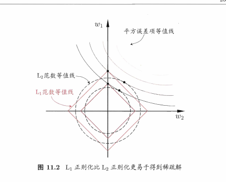

# 线性模型

## 零基础引导

和分析病人的病情一样，需要多维度的数据，比如年龄，血压等等，而且单位还不一样。这里简化一下数据比如说，有100个数据，每个数据，记录了一个人的身高和体重，目标是我们求一个系数$k$使得，$weight = k*high+b$,是不是很熟悉了，b是什么呢，b是截距，可以理解为这就是坐标轴上的一条直线，而这就是直线通式，b当然也可能就是0，但是在模型建立的时候必须加上。所以我们的目标就是求k和b,已达到给出一个身高就可以带入公式求出weight.

现在的问题是怎么求k和b. 可以从误差最小化开始分析，预测的体重我们追寻误差最小，这里必须给出两个数据，实际值（$y_\{实际\}$）和预测值（$y_\{预测\}$），误差最小表示这两个值相差最小，用数学怎么表达呢，
$$
误差 = |y_\{实际\} - y_\{预测\} |
$$
如果想要用别的表示方法去掉绝对值也可以用平方和表示
$$
误差 = (y_\{实际\} - y_\{预测\})^2
$$
当然，如果误差等于0最好，因为我们的模型基于现有的100个数据，假设我们已经求出来了k和b。根据这两个关键的值我们可以求出每一个人基于身高对体重的预测值，然后，将每个的预测值和自己的实际值相减取得的绝对值可以得到100个误差的绝对值，则可以表示为这一百个绝对值相加的值越小则这个模型越准确。为什么要取绝对值也一目了然了，如果有正有负，就有可能相互抵消了，相加之后并不能反映误差总体大小。

> 先有鸡还是先有蛋

我们的目标就是求k和d,上面直接给出了具体的值才能求出对应的预测值，才有后面的事，不就是矛盾了吗。上面只是为了让读者理解何为误差最小。现实情况下，并不是基于单个身高去预测体重，可能还有年龄，体脂率，腰臀这些相关。加入模型也就是对应加一个系数而已比如
$$体重 = k_{\text{身高}} \cdot 身高 + k_{\text{体脂率}} \cdot 体脂率 + k_{\text{年龄}} \cdot 年龄 + 1\cdot b$$
至于误差的计算和上面相同。所以就变成了求各个指标对应的权值和截距的问题。

将k表示为$\boldsymbol{k} = (k_{\text{身高}}; k_{\text{体脂率}}; k_{\text{年龄}})$ 假设有一个数据项$x$ =(身高：170,体脂率：20%,年龄：60)，将这两组数据对应相乘就是预测值体重。

在数学上可将这两种类型的数据表示为向量，对应相乘表示为$$k^\{T\} \cdot x + b$$

## 基本形式

给定由 $d$ 个属性描述的示例 $\boldsymbol{x} = (x_1; x_2; \dots; x_d)$，其中 $x_i$ 是 $\boldsymbol{x}$ 在第 $i$ 个属性上的取值，线性模型 (linear model) 试图学得一个通过属性的线性组合来进行预测的函数，即

$$f(\boldsymbol{x}) = w_1x_1 + w_2x_2 + \dots + w_dx_d + b, \tag{3.1}$$

一般用向量形式写成

$$f(\boldsymbol{x}) = \boldsymbol{w}^{\mathrm{T}}\boldsymbol{x} + b, \tag{3.2}$$

其中 $\boldsymbol{w} = (w_1; w_2; \dots; w_d)$。$\boldsymbol{w}$ 和 $b$ 学得之后，模型就得以确定。

例如若在西瓜问题中学得 “$f_{\text{好瓜}}(\boldsymbol{x}) = 0.2 \cdot x_{\text{色泽}} + 0.5 \cdot x_{\text{根蒂}} + 0.3 \cdot x_{\text{敲声}} + 1$”，则意味着可通过综合考虑色泽、根蒂和敲声来判断瓜好不好，其中根蒂最要紧，而敲声比色泽更重要。

## 求解目标

$$
w,即如何得到每个属性相乘的系数
$$

## 线性回归

给定数据集 $D = (\boldsymbol{x}_1, y_1), (\boldsymbol{x}_2, y_2), \dots, (\boldsymbol{x}_m, y_m)$
，其中$$\boldsymbol{x}_i = (x_\{i1\}; x_\{i2\}; \dots; x_\{id\})$$

我们先考虑一种最简单的情形：输入属性的数目只有一个。为便于讨论，此时我们忽略关于属性的下标，即 $D = \{(x_i, y_i)\}_{i=1}^m$，其中 $x_i \in \mathbb{R}$。

线性回归试图学得
$$f(x_i) = wx_i + b, \text{ 使得 } f(x_i) \simeq y_i . \tag{3.3}$$

如何确定 $w$ 和 $b$ 呢？显然，关键在于如何衡量 $f(x)$ 与 $y$ 之间的差别。2.3 节介绍过，均方误差 (2.2) 是回归任务中最常用的性能度量，因此我们可以试图让均方误差最小化，即

$$
(w^*, b^*) = \mathop{\arg\min}_\{(w, b)\} \sum_\{i=1\}^m (f(x_i) - y_i)^2
$$

$$
= \mathop{\arg\min}_\{(w, b)\} \sum_\{i=1\}^m (y_i - wx_i - b)^2 . \tag{3.4}
$$

求解 $w$ 和 $b$ 使 $E_\{(w,b)\} = \sum_\{i=1\}^m(y_i - wx_i - b)^2$ 最小化的过程，称为线性回归模型的最小二乘“参数估计” (parameter estimation)。我们可将 $E_\{(w,b)\}$ 分别对 $w$ 和 $b$ 求导，得到

$$
\frac{\partial E_\{(w,b)\}}{\partial w} = 2\left(w \sum_\{i=1\}^m x_i^2 - \sum_\{i=1\}^m (y_i - b) x_i\right) \tag{3.5}
$$

$$
\frac{\partial E_\{(w,b)\}}{\partial b} = 2\left(mb - \sum_\{i=1\}^m (y_i - wx_i)\right) \tag{3.6}
$$

然后令式(3.5)和(3.6)为零可得到 $w$ 和 $b$ 最优解的闭式(closed-form)解

$$
w = \frac{\sum_\{i=1\}^m y_i(x_i - \bar{x})}{\sum_\{i=1\}^m x_i^2 - \frac{1}{m}\left(\sum_\{i=1\}^m x_i\right)^2} \tag{3.7}
$$

$$
b = \frac{1}{m} \sum_\{i=1\}^m (y_i - wx_i) \tag{3.8}
$$

其中 $\bar{x} = \frac{1}{m} \sum_\{i=1\}^m x_i$ 为 $x$ 的均值。

### 💡 补充：详细推导过程（需要高数偏导数基础）

均方误差损失函数为：
$$
E_\{(w,b)\} = \sum_\{i=1\}^m (y_i - wx_i - b)^2
$$

**1. 对 $w$ 的偏导数推导 $\frac{\partial E}{\partial w}$**

根据链式法则，令 $u_i = y_i - wx_i - b$，则 $\frac{\partial u_i}{\partial w} = -x_i$。
对求和式中的每一项求导：

$$
\begin{aligned}
\frac{\partial E}{\partial w} &= \frac{\partial}{\partial w} \sum_\{i=1\}^m (y_i - wx_i - b)^2 \\
&= \sum_\{i=1\}^m 2(y_i - wx_i - b) \cdot \frac{\partial}{\partial w}(y_i - wx_i - b) \\
&= \sum_\{i=1\}^m 2(y_i - wx_i - b) \cdot (-x_i) \\
&= 2 \sum_\{i=1\}^m (wx_i^2 + bx_i - y_ix_i) \\
&= 2 \left( w\sum_\{i=1\}^m x_i^2 - \sum_\{i=1\}^m (y_i - b)x_i \right)
\end{aligned} \tag{3.5推导}
$$

**2. 对 $b$ 的偏导数推导 $\frac{\partial E}{\partial b}$**

同样利用链式法则，此时 $\frac{\partial u_i}{\partial b} = -1$。
注意常数的求和性质 $\sum_\{i=1\}^m b = mb$：

$$
\begin{aligned}
\frac{\partial E}{\partial b} &= \frac{\partial}{\partial b} \sum_\{i=1\}^m (y_i - wx_i - b)^2 \\
&= \sum_\{i=1\}^m 2(y_i - wx_i - b) \cdot (-1) \\
&= -2 \sum_\{i=1\}^m (y_i - wx_i - b) \\
&= -2 \left( \sum_\{i=1\}^m y_i - \sum_\{i=1\}^m wx_i - \sum_\{i=1\}^m b \right) \\
&= 2 \left( mb - \sum_\{i=1\}^m (y_i - wx_i) \right)
\end{aligned} \tag{3.6推导}
$$

--------------

### 矩阵表达（需线性代数基础）

类似的，可利用最小二乘法来对 $\boldsymbol{w}$ 和 $b$ 进行估计。为便于讨论，我们把 $\boldsymbol{w}$ 和 $b$ 吸收入向量形式 $\hat{\boldsymbol{w}} = (\boldsymbol{w}; b)$，相应的，把数据集 $D$ 表示为一个 $m \times (d+1)$ 大小的矩阵 $\mathbf{X}$，其中每行对应于一个示例，该行前 $d$ 个元素对应于示例的 $d$ 个属性值，最后一个元素恒置为 1，即

$$
\mathbf{X} = \begin{pmatrix}
x_\{11\} & x_\{12\} & \dots & x_\{1d\} & 1 \\\\
x_\{21\} & x_\{22\} & \dots & x_\{2d\} & 1 \\\\
\vdots & \vdots & \ddots & \vdots & \vdots \\\\
x_\{m1\} & x_\{m2\} & \dots & x_\{md\} & 1
\end{pmatrix} = \begin{pmatrix}
\boldsymbol{x}_1^\mathrm{T} & 1 \\\\
\boldsymbol{x}_2^\mathrm{T} & 1 \\\\
\vdots & \vdots \\\\
\boldsymbol{x}_m^\mathrm{T} & 1
\end{pmatrix}
$$

再把标记也写成向量形式 $\boldsymbol{y} = (y_1; y_2; \dots; y_m)$，则类似式(3.4)，有

$$
\hat{\boldsymbol{w}}^* = \mathop{\arg\min}_\{\hat{\boldsymbol{w}}\} (\boldsymbol{y} - \mathbf{X}\hat{\boldsymbol{w}})^\mathrm{T} (\boldsymbol{y} - \mathbf{X}\hat{\boldsymbol{w}}) . \tag{3.9}
$$

令 $E_\{\hat{\boldsymbol{w}}\} = (\boldsymbol{y} - \mathbf{X}\hat{\boldsymbol{w}})^\mathrm{T} (\boldsymbol{y} - \mathbf{X}\hat{\boldsymbol{w}})$，对 $\hat{\boldsymbol{w}}$ 求导得到

$$
\frac{\partial E_\{\hat{\boldsymbol{w}}\}}{\partial \hat{\boldsymbol{w}}} = 2\mathbf{X}^\mathrm{T}(\mathbf{X}\hat{\boldsymbol{w}} - \boldsymbol{y}) . \tag{3.10}
$$

> **💡 补充细节：从 (3.9) 到 (3.10) 的矩阵求导推导**
>
> 1. **展开损失函数**：
> 利用转置性质 $(A-B)^\mathrm{T} = A^\mathrm{T} - B^\mathrm{T}$，将 $E_{\hat{\boldsymbol{w}}}$ 展开：
>
> $$
> \begin{aligned}
> E_{\hat{\boldsymbol{w}}} &= (\boldsymbol{y}^\mathrm{T} - \hat{\boldsymbol{w}}^\mathrm{T}\mathbf{X}^\mathrm{T}) (\boldsymbol{y} - \mathbf{X}\hat{\boldsymbol{w}}) \\
> &= \boldsymbol{y}^\mathrm{T}\boldsymbol{y} - \boldsymbol{y}^\mathrm{T}\mathbf{X}\hat{\boldsymbol{w}} - \hat{\boldsymbol{w}}^\mathrm{T}\mathbf{X}^\mathrm{T}\boldsymbol{y} + \hat{\boldsymbol{w}}^\mathrm{T}\mathbf{X}^\mathrm{T}\mathbf{X}\hat{\boldsymbol{w}}
> \end{aligned}
> $$
> 注意到 $\boldsymbol{y}^\mathrm{T}\mathbf{X}\hat{\boldsymbol{w}}$ 是一个标量，标量的转置等于其本身，即 $\boldsymbol{y}^\mathrm{T}\mathbf{X}\hat{\boldsymbol{w}} = (\boldsymbol{y}^\mathrm{T}\mathbf{X}\hat{\boldsymbol{w}})^\mathrm{T} = \hat{\boldsymbol{w}}^\mathrm{T}\mathbf{X}^\mathrm{T}\boldsymbol{y}$。因此中间两项可以合并：
> $$
> E_{\hat{\boldsymbol{w}}} = \boldsymbol{y}^\mathrm{T}\boldsymbol{y} - 2\hat{\boldsymbol{w}}^\mathrm{T}\mathbf{X}^\mathrm{T}\boldsymbol{y} + \hat{\boldsymbol{w}}^\mathrm{T}\mathbf{X}^\mathrm{T}\mathbf{X}\hat{\boldsymbol{w}}
> $$
>
> 1. **对向量 $\hat{\boldsymbol{w}}$ 求导**：
> 利用矩阵求导公式 $\frac{\partial \boldsymbol{x}^\mathrm{T}\boldsymbol{a}}{\partial \boldsymbol{x}} = \boldsymbol{a}$ 和 $\frac{\partial \boldsymbol{x}^\mathrm{T}\mathbf{A}\boldsymbol{x}}{\partial \boldsymbol{x}} = 2\mathbf{A}\boldsymbol{x}$ (当 $\mathbf{A}$ 对称时)：
>
> * 第一项 $\boldsymbol{y}^\mathrm{T}\boldsymbol{y}$ 对 $\hat{\boldsymbol{w}}$ 导数为 0。
> * 第二项 $-2\hat{\boldsymbol{w}}^\mathrm{T}(\mathbf{X}^\mathrm{T}\boldsymbol{y})$ 导数为 $-2\mathbf{X}^\mathrm{T}\boldsymbol{y}$。
> * 第三项 $\hat{\boldsymbol{w}}^\mathrm{T}(\mathbf{X}^\mathrm{T}\mathbf{X})\hat{\boldsymbol{w}}$ 导数为 $2\mathbf{X}^\mathrm{T}\mathbf{X}\hat{\boldsymbol{w}}$。
>
> 最终得到：
> $$
> \frac{\partial E_{\hat{\boldsymbol{w}}}}{\partial \hat{\boldsymbol{w}}} = -2\mathbf{X}^\mathrm{T}\boldsymbol{y} + 2\mathbf{X}^\mathrm{T}\mathbf{X}\hat{\boldsymbol{w}} = 2\mathbf{X}^\mathrm{T}(\mathbf{X}\hat{\boldsymbol{w}} - \boldsymbol{y})
> $$

即得到书中式(3.10)：

$$
\frac{\partial E_{\hat{\boldsymbol{w}}}}{\partial \hat{\boldsymbol{w}}} = 2\mathbf{X}^\mathrm{T}(\mathbf{X}\hat{\boldsymbol{w}} - \boldsymbol{y}) . \tag{3.10}
$$

令上式为零可得 $\hat{\boldsymbol{w}}$ 最优解的闭式解，但由于涉及矩阵逆的计算，比单变量情形要复杂一些。下面我们做一个简单的讨论。

当 $\mathbf{X}^\mathrm{T}\mathbf{X}$ 为满秩矩阵(full-rank matrix)或正定矩阵(positive definite matrix)时，令式(3.10)为零可得

$$
\hat{\boldsymbol{w}}^* = (\mathbf{X}^\mathrm{T}\mathbf{X})^{-1}\mathbf{X}^\mathrm{T}\boldsymbol{y} , \tag{3.11}
$$

其中 $(\mathbf{X}^\mathrm{T}\mathbf{X})^{-1}$ 是矩阵 $(\mathbf{X}^\mathrm{T}\mathbf{X})$ 的逆矩阵。令 $\hat{\boldsymbol{x}}_i = (\boldsymbol{x}_i, 1)$，则最终学得的多元线性回归模型为

$$
f(\hat{\boldsymbol{x}}_i) = \hat{\boldsymbol{x}}_i^\mathrm{T} (\mathbf{X}^\mathrm{T}\mathbf{X})^{-1} \mathbf{X}^\mathrm{T}\boldsymbol{y} . \tag{3.12}
$$

## 过拟合

设想以下场景，坐标上有两个样本点(0,0)和(1，1)，我们口算就能得出一个简单解：直线 $y = x$。但实际上，经过这两个点的曲线有无穷多条，比如抛物线 $y = x^2$ 甚至更波动的高阶曲线。问题在于： 虽然它们都能完美拟合这两个点（训练误差都为0），但如果我们引入第三个测试点（未知数据），那些为了“强行经过”已知点而弯来弯去的复杂曲线，预测效果往往很差。这就是过拟合——模型太努力地记忆已知数据，导致失去了对未知数据的泛化能力。

## 正则项（惩罚项）

在拟合过程中如何防止模型变得太复杂（过拟合）呢？我们采用“奖惩机制”。原本我们的目标只是让预测误差最小，现在我们修改规则，定义一个新的总代价（Cost）：$$\text{总代价} = \text{预测误差} + \text{惩罚项}$$惩罚项是一个关于参数 $w$ 大小的式子（比如 $|w|$ 或 $w^2$）。
> L1范数

$$
|\boldsymbol{w}| = |w_1|+|w_2|+|w_3|+.... 
$$
> L2范数

$$
\boldsymbol{w^2} = w_1^2+w_2^2+w_3^2+....
$$
机制： 如果模型试图通过大幅增加参数值（把直线扭曲成复杂的曲线）来减少那一点点预测误差，惩罚项就会迅速变大，导致“总代价”反而升高，得不偿失。目的： 迫使模型在“拟合得好”和“参数简单”之间找到平衡。我们在寻找那一组既能大致拟合数据，参数又不会太夸张的解。

## 特征值数（属性数大于样本数）

然而，现实任务中 $\mathbf{X}^\mathrm{T}\mathbf{X}$ 往往不是满秩矩阵。例如在许多任务中我们会遇到大量的变量，其数目甚至超过样例数，导致 $\mathbf{X}$ 的列数多于行数，$\mathbf{X}^\mathrm{T}\mathbf{X}$ 显然不满秩。此时可解出多个 $\hat{\boldsymbol{w}}$，它们都能使均方误差最小化。选择哪一个解作为输出，将由学习算法的归纳偏好决定，常见的做法是引入正则化 (regularization) 项。

正如上文所述，当 $\mathbf{X}^\mathrm{T}\mathbf{X}$ 不满秩时，会导致过拟合。为了解决这个问题，我们通常在损失函数中加入“正则化项” (regularization term)。

最常见的两种形式是 **Lasso 回归** 和 **Ridge 回归**。

## 1. Lasso 回归 (L1 正则化)

Lasso (Least Absolute Shrinkage and Selection Operator) 在均方误差的基础上，增加了一个参数向量的 **L1 范数**作为惩罚项：

$$
E_\{Lasso\}（误差总值） = \sum_\{i=1\}^m (y_i - \boldsymbol{w}^\mathrm{T}\boldsymbol{x}_i)^2 + \lambda \|\boldsymbol{w}\|_1 \tag{L1}
$$

其中 $\|\boldsymbol{w}\|_1 = \sum_\{j=1\}^d |w_j|$，$\lambda > 0$ 是控制正则化强度的超参数。$|w_j|$代表对应的

* **特点**：Lasso 倾向于让许多 $w_j$ 变为 **0**。
* **作用**：因此 Lasso 可以实现 **特征选择** (Feature Selection)，即自动筛选出有用的属性，得到“稀疏解”。
* **几何意义**：
  

首先$\lambda$是事先确定的一个数，等值线上的每一个点都代表了不同的参数的组合，但这些组合产生的误差一样，这就是不满秩矩阵多个解造成的结果，

> 如何看懂这个图

总误差表达式开始分析，前半部分，是各个样本实际值减去预测值的平方和，

以(1,1)为圆心，半径为2的圆的表达式 $$4 = (w_1 - 1)^2 + (w_2 - 1)^2$$,是不是很熟悉了，抽象出式子
$$E_{误差} = (w_1 - 1)^2 + (w_2 - 1)^2$$此时若，$w_1 = 1,w_2 = 1$则误差为零了，但是像上述情况讲的，如果将平面变成三维图形，加入了z轴（对应等于$w_3$），则只要当$w_1 = 1,w_2 = 1,而不管w_3$等于任何数都可以使得误差等于零，这就是多个解的情况，而且就算不引入$w_3$符合模型的表达式也一大堆，容易过拟合。

那如果将误差限定在一个范围内呢？，这个好像违背了误差最小的最终目的。但是要知道的是尽管是理想情况下的线性模型，每个个体产生的数据也是有误差的，多多少少会在真实的线上下波动，我们加上惩罚项，强行加大误差，是为了让模型更稳定。

好了，终于可以讲这个图了，我们看到的误差等值线其实就是我们允许误差的范围，圆心对应误差为零，越往圆（实际详情其实是椭圆，但是变化趋势相同）外走误差越大。接下来就是L1范数对应的菱形，设想这个表达式$$1 = |w_1|+|w_2|$$,这就是一个菱形。我们来到表达式的后半段，当参数$\boldsymbol{w}$确认了，平方误差等值线也确认了，当然菱形的大小也确认了，通过设定$\lambda$的大小可以影项最终误差的大小。当然我们追求的是误差的最小化，而前面我们提过，等值线半径越大，误差越大，所以在菱形确定的情况下，我们取随等值线半径增大与菱形的第一个交点，如果等值线圆心刚好在$y=x$这条线上（概率极小，如果是椭圆，则更难得到中点的情况），则这个点就是线段在第一象限的中点。但是大多数情况下，第一个交点在坐标轴上，这意味着某个参数要取0，这表示整个模型与这个参数无关了，间接起到了减少自由度的作用，使得多个解变为一个解。

实际上，误差等值线几乎不可能是圆，我们没有分析的是，属性之间会相互影响，属性之间的单位尺度也不一样，所以是一个椭圆，但是不影响椭圆面积越大误差越大的属性，而且这回加深即使圆心在$y=x$这条线上，如果是椭圆，也不一定与第一象限的直线相切的情况。
> 椭圆数学解释

假设只有两个样本，误差公式展开如下：

$$
Loss = (y - (w_1x_1 + w_2x_2))^2
$$

展开平方项（回忆 $(a+b)^2 = a^2 + b^2 + 2ab$）：

$$
Loss \approx \underbrace{w_1^2x_1^2}_{\text{只和 } w_1 \text{ 有关}} + \underbrace{w_2^2x_2^2}_{\text{只和 } w_2 \text{ 有关}} + \underbrace{2w_1w_2(x_1x_2)}_{\text{交叉项!}}
$$

关于交叉项 $2w_1w_2(x_1x_2)$ 的讨论：

* **如果特征独立 (正交)**：$\sum x_1x_2 \approx 0$，交叉项消失。方程变成 $Aw_1^2 + Bw_2^2 = C$（正椭圆）。
* **如果特征相关 (相互影响)**：$\sum x_1x_2$ 很大，意味着方程包含 $w_1w_2$ 这一项，导致图形发生旋转。

## 2. Ridge 回归 (岭回归 / L2 正则化)

Ridge 回归则是加入了参数向量的 **L2 范数**（的平方）：

$$
E_\{Ridge\} = \sum_\{i=1\}^m (y_i - \boldsymbol{w}^\mathrm{T}\boldsymbol{x}_i)^2 + \lambda \|\boldsymbol{w}\|_2^2 \tag{L2}
$$

* **特点**：Ridge 倾向于让 $w_j$ 变得很小（接近 0 但不等于 0），使模型参数分布更平滑。
* **闭式解**：引入 L2 正则后，$\mathbf{X}^\mathrm{T}\mathbf{X} + \lambda \mathbf{I}$ 变为满秩矩阵，因此一定存在唯一逆矩阵，解决了不满秩的问题：
    $$\hat{\boldsymbol{w}}^* = (\mathbf{X}^\mathrm{T}\mathbf{X} + \lambda \mathbf{I})^{-1}\mathbf{X}^\mathrm{T}\boldsymbol{y}$$

#### 💡 几何意义对比

* **Lasso (L1)** 的约束域在几何上是一个菱形（或多面体），等高线更容易与坐标轴（即 $w_j=0$ 的位置）相切，从而产生稀疏解。
* **Ridge (L2)** 的约束域是一个圆形（或球体），等高线与圆相切的点通常不在坐标轴上，因此参数只会变小而不会变零。
