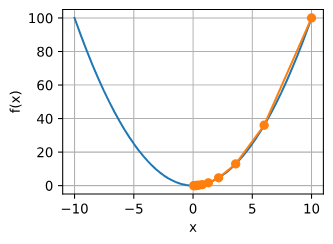

# 梯度下降（Gradient Descent）

理想情况下我们求的函数假定为凸函数，如上图的一维loss函数，我们需要求的是最低点时的值，此时不考虑正则项之类的泛化需求。

## 泰勒展开引入

$$f(x) = f(x_0) + f'(x_0)(x - x_0) + \frac{f''(x_0)}{2!}(x - x_0)^2 + \dots$$

这个展开表示的是，已知在 $x_0$ 点的各种信息，我想估算它附近某一点 $x$ 的函数值。

在深度学习寻找最低点的时候，并不能直观的看到上图，只能沿着一个坐标滑动寻找loss在最低点，所以泰勒展开给了查看附近点的函数值的路径，使得即使随机一个初始值也能通过滑动点寻找最低点的路径

## 梯度下降推导

> 1. 式子变换

上面的式子中$x-x_0$可以看作为步长，很奇妙的是这个步长不是标量而是向量，如果是负数可以理解为左附近，正值表示右附近。
为了方便推导，将  $$ \epsilon  = x-x_0 $$
然后展开公式变成了
$$f(x + \epsilon) = f(x) + f'(x)\epsilon + \frac{f''(x)}{2!}\epsilon^2 + \dots$$

我们抓大放小，去掉后面的高阶项得到
$$f(x + \epsilon) = f(x) + \epsilon f'(x) + \mathcal{O}(\epsilon^2)$$
$$f(x + \epsilon) \approx f(x) + \epsilon f'(x)$$

> 2. 步子怎么迈？

代码会呈现不同参数下的loss大小，那如何判断参数该是加还是减呢，我们的目标是

$$
f(x + \epsilon) \approx f(x) + \epsilon f'(x) < f(x)
$$

不难看出只要$\epsilon f'(x)$小于零就行了，所以令步长$\epsilon = -\eta f'(x)^{[1]}$（**可以看成学习率成反向梯度**）

- $\eta$ (eta) 是一个预先设定的正数，也就是深度学习里常说的学习率（Learning Rate）。

- 负号 - 代表我们要逆着梯度（导数）的方向走。

> 等价代换

现在，把 $\epsilon = -\eta f'(x)$ 原封不动地代回到第一步的泰勒展开式中：

等式左边的 $x + \epsilon$ 变成了：$x - \eta f'(x)$

等式右边的第二项 $\epsilon f'(x)$ 变成了：$(-\eta f'(x)) \cdot f'(x) = -\eta f'^2(x)$

等式右边的高阶项变成了：$\mathcal{O}((-\eta f'(x))^2) = \mathcal{O}(\eta^2 f'^2(x))$

把它们重新拼起来，就完美得到了公式 ：

$$f(x - \eta f'(x)) = f(x) - \eta f'^2(x) + \mathcal{O}(\eta^2 f'^2(x))$$

> 剪枝

因为设置的学习率大于零，所以对其进行剪枝

$$f(x - \eta f'(x)) \lesssim f(x) \\\\ = f(x - \epsilon) \lesssim f(x) （凸函数显现）$$

> 结论

$$x \leftarrow x - \eta f'(x)$$
数学上严格证明了：如果把位置从 $x$ 更新到 $x - \eta f'(x)$，函数的整体值一定会下降。

- 参考文献：

[1] [李沐，动手深度学习](https://d2l.ai/chapter_optimization/gd.html)