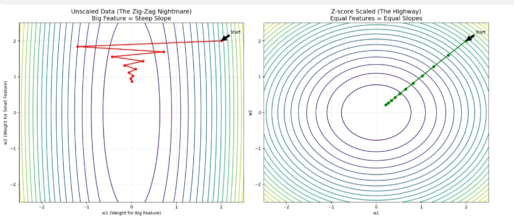

# 数据预处理 (Data Preprocessing)

## Z-score Standardization

也称为 **标准化 (Standard Scaler)**。该方法将数据转换为均值为 0、标准差为 1 的分布。适用于数据近似服从高斯分布（正态分布）的情况。

> 引入

# Z-score 标准化的必要性与推导

## 1. 为什么需要 Z-score？(The Necessity)

在机器学习和数据分析中，不同特征（Feature）通常具有不同的量纲和数量级（例如：由于单位不同，“身高”可能是 $1.7\sim1.9$，而“年收入”可能是 $50000\sim100000$）。如果不进行标准化，会带来以下问题：

### (1) 梯度下降收敛速度慢 (Gradient Descent Convergence)
如果特征的尺度不一致，损失函数（Loss Function）的等高线图会呈现为细长的椭圆形。
* **未标准化**：梯度下降过程会在椭圆的长轴方向上发生剧烈的震荡，导致收敛路径呈“之”字形（Zig-zag），收敛非常缓慢。

设想一下如下线性模型

> 证明误差等值线是一个椭圆

$$
\hat{y} = w_1x_1+w_2x_2
$$
对应的损失函数
$$J(w_1,w_2) = (\hat{y}-y)^2 = (w_1x_1+w_2x_2-y)^2$$

$$
J(w_1, w_2) = \underbrace{x_1^2}_\{\text{系数A}} \cdot w_1^2 + \underbrace{x_2^2}_\{\text{系数B}} \cdot w_2^2 + \dots (\text{交叉项和常数项})
$$
这就很清楚了，系数A和B完全取决于样本点的数值大小，所以误差等值线是一个椭圆

结论：这是一个关于参数 $w_1, w_2$ 的二次曲面方程。

$w_1^2$ 的系数是特征值的平方 $x_1^2$。

$w_2^2$ 的系数是特征值的平方 $x_2^2$

$x_1=100, x_2=1$），则系数 $A \gg B$。

这种巨大的系数差异导致曲面在不同方向的曲率极度不均，从而在几何上形成了细长的椭圆。

> 证明未标准化的梯度方向不指向圆心

为了方便计算，设损失函数为

$$L = \frac{1}{2}(\hat{y} - y)^2$$

然后计算偏导数值

$$\frac{\partial L}{\partial w_1} = \underbrace{\frac{\partial L}{\partial \hat{y}}}_{\text{损失对预测值的导数}} \times \underbrace{\frac{\partial \hat{y}}{\partial w_1}}_\{\text{预测值对权重的导数}}$$

先看第一部分

$$\frac{\partial (\frac{1}{2}(\hat{y} - y)^2)}{\partial \hat{y}} = (\hat{y} - y)$$

然后是第二部分

$$\frac{\partial (w_1x_1+w_2x_2)}{\partial w_1} = x_1$$

所以
$$\frac{\partial L}{\partial w} = (\hat{y} - y) \cdot x = \text{误差} \times \text{输入特征}$$

**这造成了一个变量的数量影响了偏导数的大小**，如果另一个变量的数值小这两个偏导数的向量和会极度偏向特征值大的特征，使之不指向圆心并且极容易跑到对面坡顶上，所以需要进行z-score标准化。

* **标准化后**：等高线变得接近圆形，梯度方向直接指向最小值圆心，收敛速度显著加快。

### (2) 基于距离算法的偏差 (Bias in Distance-based Algorithms)
对于 KNN (K-Nearest Neighbors)、K-Means、SVM 等依赖欧氏距离（Euclidean Distance）的算法：
$$
d(x, y) = \sqrt{\sum_{i=1}^{n} (x_i - y_i)^2}
$$
如果某一个特征（如“年收入”）的数值范围远大于其他特征（如“年龄”），那么距离计算将被大数值特征完全主导，导致小数值特征的信息被忽略。

### (3) 模型假设 (Model Assumptions)
某些算法（如线性判别分析 LDA、高斯朴素贝叶斯）假设特征数据服从**标准正态分布**。Z-score 是满足这一假设的最直接手段。

---

## 2. 数学推导 (Mathematical Derivation)

我们的目标是寻找一个线性变换，将任意随机变量 $X$ 映射为新的变量 $Z$，使得 $Z$ 满足标准正态分布的两个核心属性：
1.  **均值 (Mean) 为 0**：$E[Z] = 0$
2.  **方差 (Variance) 为 1**：$\text{Var}(Z) = 1$

### 设定线性变换
假设我们要对随机变量 $X$ 做如下线性变换：
$$
Z = aX + b
$$
其中 $a$ 是缩放因子，$b$ 是平移因子。我们需要求解 $a$ 和 $b$。

### 第一步：确定平移因子 $b$ (Centering)
根据期望的线性性质 $E[aX + b] = aE[X] + b$。
我们需要 $E[Z] = 0$，设 $X$ 的均值为 $\mu$（即 $E[X] = \mu$）：

$$
\begin{aligned}
E[Z] &= E[aX + b] \\
0 &= aE[X] + b \\
0 &= a\mu + b \\
\Rightarrow b &= -a\mu
\end{aligned}
$$

将 $b$ 代入原方程，现在的变换变为：
$$
Z = aX - a\mu = a(X - \mu)
$$
这一步实现了**中心化**。

### 第二步：确定缩放因子 $a$ (Scaling)
根据方差的性质 $\text{Var}(aX) = a^2 \text{Var}(X)$（常数的方差为0）。
我们需要 $\text{Var}(Z) = 1$，设 $X$ 的方差为 $\sigma^2$（即 $\text{Var}(X) = \sigma^2$）：

$$
\begin{aligned}
\text{Var}(Z) &= \text{Var}(a(X - \mu)) \\
1 &= a^2 \text{Var}(X - \mu) \\
1 &= a^2 \text{Var}(X) \\
1 &= a^2 \sigma^2
\end{aligned}
$$

解出 $a$：
$$
a^2 = \frac{1}{\sigma^2} \Rightarrow a = \frac{1}{\sigma}
$$
*(注：标准差 $\sigma$ 恒为正，取正根)*

### 第三步：得出最终公式
将解得的 $a = \frac{1}{\sigma}$ 和 $b = -\frac{\mu}{\sigma}$ 代入 $Z = aX + b$，即得到 Z-score 公式：

$$
Z = \frac{1}{\sigma}(X - \mu) \Rightarrow \boxed{ Z = \frac{X - \mu}{\sigma} }
$$

---

## 3. 验证 (Verification)

为了确保公式正确，我们可以反向验证变换后变量 $Z$ 的期望和方差。

**验证均值为 0：**
$$
E[Z] = E\left[\frac{X - \mu}{\sigma}\right] = \frac{1}{\sigma}(E[X] - \mu) = \frac{1}{\sigma}(\mu - \mu) = 0
$$

**验证方差为 1：**
$$
\text{Var}(Z) = \text{Var}\left(\frac{X - \mu}{\sigma}\right) = \left(\frac{1}{\sigma}\right)^2 \text{Var}(X - \mu) = \frac{1}{\sigma^2} \cdot \sigma^2 = 1
$$

证毕。

### 公式

Z-score 的本质就是：不再用“元/米/千克”做单位，而是用“标准差”做单位。

$$z = \frac{x - \mu}{\sigma}$$

分子 $(x - \mu)$：把中心平移到 0（去中心化）。

分母 $(/\sigma)$：把数据的“宽窄”强制压缩为 1。

### 特点
* 处理后的数据 **均值 $= 0$**，**标准差 $= 1$**。
* 不限制数据的取值范围（无界），因此对异常值依然敏感，但比 Min-Max 稍好。

---

## Min-Max Standardization

也称为 **归一化 (Min-Max Scaler)**。该方法通过线性变换将数据映射到固定的范围，通常是 $[0, 1]$。

### 公式

$$
x_{\text{norm}} = \frac{x - x_{\text{min}}}{x_{\text{max}} - x_{\text{min}}}
$$

如果要映射到任意范围 $[a, b]$：

$$
x_{\text{scaled}} = a + \frac{(x - x_{\text{min}})(b - a)}{x_{\text{max}} - x_{\text{min}}}
$$

**符号说明：**
* $x_{\text{min}}$ : 特征列的最小值
* $x_{\text{max}}$ : 特征列的最大值

### 特点
* 数据严格限制在 $[0, 1]$ 之间。
* **对异常值非常敏感**。如果存在极端最大值，大部分数据会被压缩到非常小的区间。
* 适用于图像处理（像素 $0\sim255$ 转 $0\sim1$）或神经网络输入。

---

## Robust Scaler (鲁棒缩放)

当数据包含许多**异常值 (Outliers)** 时，均值和方差会产生偏差。Robust Scaler 使用对异常值不敏感的统计量（中位数和四分位距）进行缩放。

### 公式

$$
x_{\text{robust}} = \frac{x - Q_2}{Q_3 - Q_1}
$$

**符号说明：**
* $Q_2$ : **中位数** (Median)，即 $50\%$ 分位数。
* $Q_1$ : **下四分位数** ($25\%$ 分位数)。
* $Q_3$ : **上四分位数** ($75\%$ 分位数)。
* $Q_3 - Q_1$ : **四分位距** (IQR, Interquartile Range)。

### 特点
* **鲁棒性强**：极端的异常值不会影响中位数和 IQR 的计算。
* 缩放后的数据没有固定的范围，也不保证均值为 0。
* 适用于数据中包含明显噪音或离群点的情况。

---

### 总结对比

| 方法 | 核心统计量 | 对异常值敏感度 | 结果范围 |
| :--- | :--- | :--- | :--- |
| **Z-score** | $\mu$ (均值), $\sigma$ (标准差) | 高 | 无界 |
| **Min-Max** | Min, Max | 极高 | $[0, 1]$ |
| **Robust** | Median (中位数), IQR | **低** | 无界 |